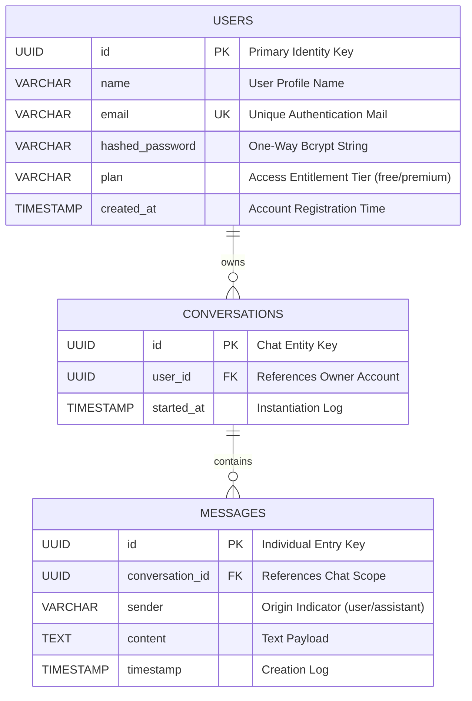
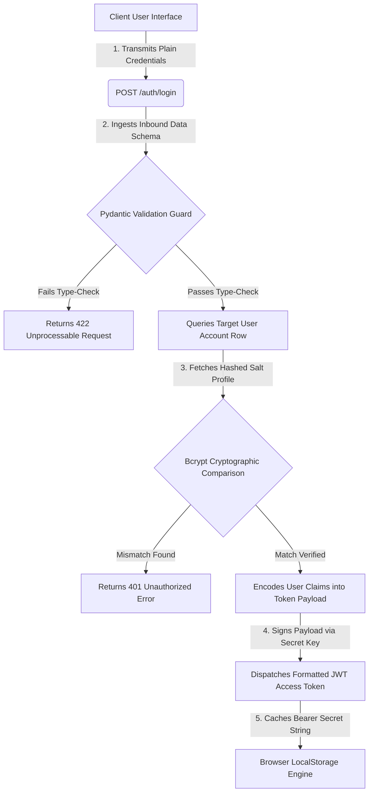
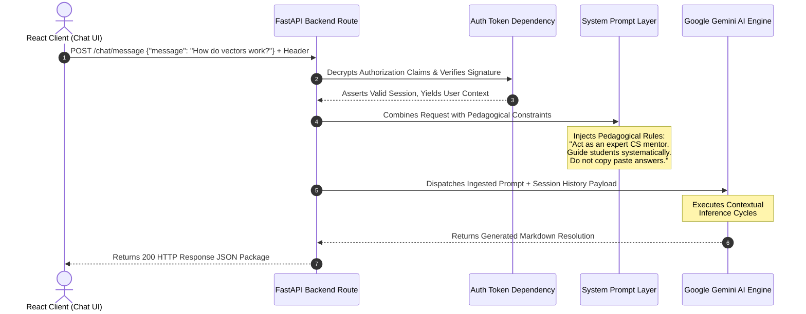
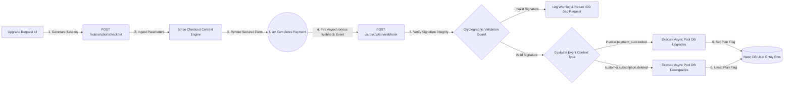

```markdown
# 📖 Study Assistant Pro — Complete Technical Documentation & Architectural Blueprint

[](https://github.com/kireetikotturu/study-assistant-pro)
[](https://study-assistant-8ex344zpq-kireetikotturus-projects.vercel.app)
[](https://study-assistant-backend-vsop.onrender.com)
[](https://study-assistant-backend-vsop.onrender.com/docs)

An enterprise-grade, asynchronous, AI-powered e-learning monorepo platform designed to provide interactive topic-wise instruction, programmatic solution practice, and adaptive tutoring for software engineering students.

---

## 🗂️ Table of Contents
1. [Project Overview](#project-overview)
2. [Core Features](#core-features)
3. [Tech Stack Rationales](#tech-stack-rationales)
4. [Complete System Architecture](#complete-system-architecture)
5. [Folder Structure & Dependency Mapping](#folder-structure--dependency-mapping)
6. [Frontend Architecture](#frontend-architecture)
7. [Backend Architecture](#backend-architecture)
8. [Database Schema & Entity Relationships](#database-schema--entity-relationships)
9. [JWT Authentication Flow](#jwt-authentication-flow)
10. [AI Core Engine Flow](#ai-core-engine-flow)
11. [Stripe Subscription Lifecycle](#stripe-subscription-lifecycle)
12. [API Specification Ledger](#api-specification-ledger)
13. [End-to-End Request Lifecycles](#end-to-end-request-lifecycles)
14. [Local Installation Guide](#local-installation-guide)
15. [Production Deployment Guide](#production-deployment-guide)
16. [Technical Challenges & Resolution Log](#technical-challenges--resolution-log)
17. [Security Hardening Matrix](#security-hardening-matrix)
18. [Performance Benchmarks](#performance-benchmarks)
19. [Future Enhancements Blueprint](#future-enhancements-blueprint)
20. [Recruiter & Technical Interview Guide](#interview-guide)

---

## 🚀 Project Overview

### What the Project Is
**Study Assistant Pro** is an asynchronous, end-to-end software engineering e-learning platform. It acts as an interactive tutor and code mentor, providing real-time explanations, solution generation, and dynamic chat utilities designed specifically for computer science student bodies.

### Why It Was Built
The project was engineered to solve the disconnect between generic generative AI models and structured pedagogical guidelines. While regular chatbots present raw solutions immediately, this platform is tailored to help students learn iteratively through dynamic context-aware prompts, robust backend security, and gatekeep premium advanced capabilities behind a subscription wall.

### The Problem It Solves
*   **Passive Copying vs. Active Learning:** Prevents students from plain copying code by introducing systematic, guided explanations using precise prompt engineering.
*   **State Persistence Obstacles:** Eliminates lost context sessions by persisting message sequences in a normalized relational database.
*   **Unstructured Monorepos:** Demonstrates how to design, secure, isolate, and deploy a decoupled React frontend and FastAPI backend out of a single GitHub repository safely.

### Target Users
*   **Computer Science Students:** Individuals studying Data Structures, Algorithms (DSA), and Object-Oriented Programming (OOP).
*   **EdTech Educators:** Platforms needing automated code review tools, context persistence, and isolated billing sandboxes.

---

## ✨ Core Features

*   **Robust Authentication Guard:** Secure signups and logins powered by industry-standard password derivation algorithms and encrypted stateless authentication tokens.
*   **Asynchronous AI Chat Streams:** Real-time conversational context handled through non-blocking asynchronous event loops running specialized context instructions.
*   **Stateless Component Rendering:** Fluid multi-page routing containing conditional render guards that isolate restricted app areas from unauthorized visitors.
*   **Webhook-Driven Subscription State:** Automated entitlement synchronization using cryptographic transaction events sent from payment providers straight to relational tables.

---

## 🛠️ Tech Stack Rationales


```

┌────────────────────────────────────────────────────────────────────────┐
│                          STUDY ASSISTANT PRO                           │
├───────────────────────────────────┬────────────────────────────────────┤
│ FRONTEND                          │ BACKEND                            │
│ • React (Vite UI Engine)          │ • FastAPI (Asynchronous Python)    │
│ • React Router Dom (SPA Routing)  │ • SQLAlchemy Async (Non-blocking)   │
│ • Axios / Fetch (Network Layer)   │ • Pydantic v2 (Schema Validation)  │
├───────────────────────────────────┼────────────────────────────────────┤
│ DATA & SECURITY                   │ THIRD-PARTY UTILITIES              │
│ • Neon PostgreSQL (Serverless)    │ • Google Gemini AI Core Engine     │
│ • Bcrypt / Passlib (Hashing)      │ • Stripe API (Subscription Engine) │
│ • JWT Tokens (Auth Broker)        │ • Render & Vercel (Production CI)  │
└───────────────────────────────────┴────────────────────────────────────┘

```

### Frontend

#### React.js
Chosen for its component-driven architecture and rapid reconciliation capabilities via the Virtual DOM. It allows complex UI elements, such as self-updating streaming chat panels, to re-render efficiently without impacting overall document performance.

#### Vite
Selected over outdated bundlers like Webpack due to its underlying native ES-module handling and lightning-fast Hot Module Replacement (HMR) capabilities during active development.

### Backend

#### FastAPI
Selected for its performance characteristics that stand neck-and-neck with Node.js and Go. Built directly over Starlette and Pydantic, its completely native support for `async/await` syntax allows it to handle thousands of concurrent pooling requests easily—crucial when managing long-lived server connections from AI generation tasks.

#### SQLAlchemy (Async Engine)
An Object-Relational Mapper (ORM) used with an asynchronous DBAPI driver (`asyncpg`). This setup ensures that database roundtrips do not block Python's single-threaded event loop, allowing the runtime engine to address other inbound operations while waiting for disk transactions to conclude.

#### Pydantic v2
Provides structural serialization and strict data type enforcement at the request layer. Inbound payloads are strictly validated against strongly typed classes prior to executing execution routes, guaranteeing clean sanitization boundaries.

### Database & Storage

#### Neon Serverless PostgreSQL
A cloud-native database platform separating storage from compute layers. It offers normalized structural constraints, transactions, and performance optimizations while minimizing maintenance overhead.

### Security & Subscriptions

#### Passlib & Bcrypt
Passwords must never be exposed or saved as plain readable text. The system leverages `bcrypt` through `passlib` to calculate a cryptographic salt round, outputting an irreversible, one-way hash string that remains secure even in the event of a structural data leak.

#### JSON Web Tokens (JWT)
Enables stateless authentication management. By embedding encrypted data fields inside a tamper-proof token signature, the backend can safely authenticate callers across completely detached networks without continuously polling raw database rows.

#### Stripe API & Webhooks
Handles billing securely. Webhooks allow the application to remain decoupled from credit card data management, using cryptographically verified asynchronous server loops to handle access tier modifications instead.

---

## 📊 Complete System Architecture

The following diagram maps out how an end-to-end request moves throughout the production infrastructure.

```mermaid
sequenceDiagram
    autonumber
    actor User as Client Browser (React UI)
    participant Vercel as Vercel Edge CDN
    participant Render as Render Web Service (FastAPI)
    participant Gemini as Google Gemini AI Engine
    participant Stripe as Stripe Payment Gateway
    participant DB as Neon PostgreSQL Node

    User->>Vercel: Requests Web Assets / App Interactions
    Vercel-->>User: Returns Compiled Production React Build
    
    rect rgb(30, 40, 50)
        Note over User, Render: Secured API Transaction Lifecycle
        User->>Render: Sends POST /auth/login Request with Credentials
        Render->>DB: Queries user record via Async Pool
        DB-->>Render: Returns Encrypted Password Salt String
        Render-->>User: Validates Hash & Dispatches Signed JWT Token Bearer
    end

    rect rgb(40, 30, 50)
        Note over User, Gemini: Context-Aware Inference Lifecycle
        User->>Render: Sends Chat Message Payload + JWT Token Header
        Render->>Render: Dependencies Extract Token & Authenticate User Claims
        Render->>Gemini: dispatches Structured Prompt Guidelines + Context History
        Gemini-->>Render: Streams Generated Inference Content
        Render-->>User: Forwards Formatted Content Package to State Container
    end

    rect rgb(30, 50, 40)
        Note over User, Stripe: Transaction Webhook Lifecycle
        User->>Render: Requests Checkout Session for Premium Upgrades
        Render->>Stripe: Registers Payment Intent Parameters
        Stripe-->>User: Serves Secured Checkout Frame (Credit Card Sandbox)
        User->>Stripe: Authorizes Charge Amount
        Stripe->>Render: Fires Cryptographic Webhook (invoice.payment_succeeded)
        Render->>Render: Signature Verification Endpoint Sanctifies Message Origin
        Render->>DB: Executes UPDATE Plan Flag on target User Record
        DB-->>Render: Confirms Transaction Write Committal
    end

```



---

## 📂 Folder Structure & Dependency Mapping

```
study-assistant-pro/
├── .gitignore                  # Instructs Git version tracking engine to isolate runtime binary files
├── README.md                   # System operational guide and reference manual
├── frontend/                   # Client user interface runtime environment
│   ├── .env                    # Storage containing target endpoint paths for environment linking
│   ├── index.html              # Core DOM target node mounting client code execution loops
│   ├── package.json            # Master ledger declaring Node module installations
│   ├── vite.config.js          # Resolution layer configuring build targets and framework bindings
│   └── src/                    # React codebase entry context
│       ├── main.jsx            # Bootstraps core React execution layers
│       ├── App.jsx             # Handles core layout components and structural page containers
│       ├── api.js              # Central communication utility driving system fetch requests
│       ├── AuthContext.jsx     # Controls shared application status flags across distinct nodes
│       ├── ProtectedRoute.jsx  # Route guard preventing unauthenticated access
│       ├── index.css           # Global layout constraints and style declarations
│       └── pages/              # View layer controllers managing screen state
│           ├── Login.jsx       # Interface capturing auth attempts for credential validation
│           ├── Signup.jsx      # Interface handling new account ingestion parameters
│           ├── Chat.jsx        # Conversational panel housing interactive tutoring loops
│           ├── UpgradeSuccess.jsx   # Post-checkout landing screen for verified transactions
│           └── UpgradeCancelled.jsx # Cancelled checkout fall-back landing screen
└── backend/                    # Core service infrastructure driving computational tasks
    ├── requirements.txt        # Production dependency ledger pinning explicit service modules
    ├── .env                    # Production secret key declarations
    └── app/                    # Core module system driving FastAPI engine operations
        ├── __init__.py         # Informs interpreter that folder context acts as a module package
        ├── main.py             # Instantiates server context and mounts global application routing
        ├── config.py           # Ingests runtime properties, matching active system environments
        ├── database.py         # Configures connection limits and exports database session factories
        ├── models.py           # Declares system entities and maps structural table constraints
        ├── auth.py             # Handles cryptographic functions and active token evaluations
        └── routes/             # Core path routers filtering data traffic
            ├── __init__.py     # Combines detached routing domains under single modules
            ├── auth_routes.py  # Filters account verification calls and onboarding pipelines
            ├── chat_routes.py  # Controls conversational stream interactions and inference configurations
            └── subscription_routes.py # Manages Stripe transactions and inbound webhook events

```

---

## 💻 Frontend Architecture

### Component Architecture & State Management

The user interface is an optimized **Single Page Application (SPA)** driven by Vite and React. Instead of triggering full page refreshes, changing routes mounts sub-components inside a single shell container.

Shared system variables—such as the user's active login profile or system authentication state—are managed through an **AuthContext Provider**. This creates a shared data scope using the React Context API, allowing components across the DOM tree to query authentication parameters without props-drilling.

```javascript
// Central Network Layer Mapping (frontend/src/api.js)
const API_URL = import.meta.env.VITE_API_URL || "http://localhost:8000";

export const executeSecurePost = async (endpoint, data, token = null) => {
  const headers = { "Content-Type": "application/json" };
  if (token) headers["Authorization"] = `Bearer ${token}`;

  const response = await fetch(`${API_URL}${endpoint}`, {
    method: "POST",
    headers,
    body: JSON.stringify(data),
  });
  
  if (!response.ok) {
    const errorPayload = await response.json().catch(() => ({}));
    throw new Error(errorPayload.detail || "Network transaction failure.");
  }
  return response.json();
};

```

### Route Guarding Implementation

To protect secure views, a higher-order guard component (`ProtectedRoute.jsx`) intercepts routing events. When an unauthorized user attempts to access `/chat`, the component checks for an active authorization token. If none is found, it redirects the request to the `/login` fallback layout.

---

## ⚙️ Backend Architecture

### FastAPI Startup & Routing Architecture

When the FastAPI web service boots up via the `uvicorn app.main:app` command, it executes initialization routines declared within its application life handlers:

1. **Configuration Verification:** Ingests properties directly from environment variables into a type-safe `Settings` object.
2. **Database Connection Management:** The `init_db()` method verifies network routes to the database cluster and establishes an asynchronous connection manager.
3. **Router Registry Mounting:** Gathers sub-routers from separate route modules (`auth_routes`, `chat_routes`, `subscription_routes`) and mounts them under a unified service context.

### Dependency Injection Pipeline

FastAPI leverages an implicit dependency lookup pattern via `Depends()`. For example, accessing a protected route triggers a pre-execution dependency chain that extracts the authorization header, decrypts the token signature, and yields a database session context manager.

```python
# Asynchronous Database Session Injection Utility (backend/app/database.py)
from sqlalchemy.ext.asyncio import create_async_engine, AsyncSession
from sqlalchemy.orm import sessionmaker
from app.config import settings

engine = create_async_engine(settings.database_url, echo=False, future=True)
AsyncSessionLocal = sessionmaker(engine, class_=AsyncSession, expire_on_commit=False)

async def get_db_session() -> AsyncSession:
    """Yields an active transactional database session context."""
    async with AsyncSessionLocal() as session:
        try:
            yield session
            await session.commit()
        except Exception:
            await session.rollback()
            raise
        finally:
            await session.close()

```

---

## 💾 Database Schema & Entity Relationships

The data storage system uses a normalized relational design managed via SQLAlchemy declarative tables.



### Database Tables Detail

#### 1. `users` Table

Stores account profiles, credentials, and product tiers.

* `id`: Primary identity key (`UUID`).
* `email`: Unique index column string used for account verification.
* `hashed_password`: Secure 60-character salt-hashed string.
* `plan`: User subscription status string, set to `free` by default and updated to `premium` via Stripe webhooks.

#### 2. `conversations` Table

Groups multi-message logs under a single session parent.

* `user_id`: Foreign key tracking the owner account.

#### 3. `messages` Table

Stores chronological dialogue events.

* `sender`: String flag indicating message origin (`user` or `assistant`).
* `content`: The markdown text block generated during a turn.

---

## 🔑 JWT Authentication Flow

The application uses stateless **JSON Web Tokens (JWT)** signed with a digital cryptographic key (`HS256`).



### Critical Verification Subsystems

* **Registration Phase:** Input data is verified by Pydantic against model rules (e.g., minimum length of 6 characters). The plain text password is then securely hashed using `passlib.hash.bcrypt.hash()` before being saved to the database.
* **Authentication Phase:** The login route queries database rows by email. The inbound plain password string is compared against the stored hash using `bcrypt.verify()`. If verified, the system generates a token signed with the secret key (`JWT_SECRET_KEY`) containing the user's primary identity claims.

---

## 🤖 AI Core Engine Flow



### System Prompt Engineering Layout

To maintain strict educational standards, the engine wraps user inputs in an optimized operational system prompt before calling the inference model:

```text
You are an advanced, context-aware Computer Science Mentor and Solutions Tutor. 
Your core responsibility is to guide students through coding challenges, data structures, and algorithmic problems systematically.

CRITICAL INSTRUCTIONS:
1. Never present a complete code solution immediately unless explicitly requested for verification.
2. Break down algorithmic architectures into logical, sequential steps.
3. Use Socratic reasoning to ask guided questions that help students identify bugs themselves.
4. Always format source code blocks using explicit markdown style formatting tags (e.g., ```java).

```

---

## 💳 Stripe Subscription Lifecycle

Subscriptions are managed asynchronously via automated webhooks, allowing the system to handle payment processing decoupled from core app business logic.



### Cryptographic Webhook Handler Implementation

To ensure payment messages originate genuinely from Stripe, the backend endpoint recreates the event body payload using the raw request byte-stream alongside your production secret key (`STRIPE_WEBHOOK_SECRET`).

```python
# Stripe Production Webhook Ingestion Engine (backend/app/routes/subscription_routes.py)
import stripe
from fastapi import APIRouter, Request, Header, HTTPException, Depends
from sqlalchemy.ext.asyncio import AsyncSession
from app.database import get_db_session
from app.config import settings

router = APIRouter(prefix="/subscription", tags=["Billing Engine"])

@router.post("/webhook")
async def handle_stripe_webhook(request: Request, stripe_signature: str = Header(None), db: AsyncSession = Depends(get_db_session)):
    """Receives and verifies incoming Stripe billing events."""
    payload = await request.body()
    try:
        event = stripe.Webhook.construct_event(
            payload, stripe_signature, settings.stripe_webhook_secret
        )
    except (ValueError, stripe.error.SignatureVerificationError) as err:
        raise HTTPException(status_code=400, detail=f"Cryptographic payload violation: {str(err)}")

    if event["type"] == "invoice.payment_succeeded":
        session_data = event["data"]["object"]
        customer_email = session_data.get("customer_email")
        # In production, look up the user by email or metadata ID and upgrade their plan:
        # await upgrade_user_tier(db, customer_email, plan="premium")
        print(f"Billing entitlement modification applied for: {customer_email}")

    return {"status": "success"}

```

---

## 📋 API Specification Ledger

| HTTP Method | Endpoint Target | Authorization Required | Operational Context Responsibility | Input Data Signature (JSON) | Output Return Schema (JSON) |
| --- | --- | --- | --- | --- | --- |
| `POST` | `/auth/signup` | No | Ingests new accounts; converts passwords to secure hashes. | `{"email": "str", "password": "str", "name": "str"}` | `{"id": "UUID", "email": "str", "status": "created"}` |
| `POST` | `/auth/login` | No | Validates credentials and returns temporary session access keys. | `{"email": "str", "password": "str"}` | `{"access_token": "str", "token_type": "bearer"}` |
| `POST` | `/chat/message` | **Yes (JWT Bearer)** | Processes prompts within active context layers. | `{"message": "str"}` | `{"response": "str", "session_id": "str"}` |
| `POST` | `/subscription/checkout` | **Yes (JWT Bearer)** | Configures Stripe transaction contexts. | None | `{"checkout_url": "str"}` |
| `POST` | `/subscription/webhook` | No | Asynchronously handles Stripe subscription state changes. | Raw Byte Ingestion | `{"status": "success"}` |

---

## 🔄 End-to-End Request Lifecycles

### 1. User Registration Lifecycle

1. **UI Entry Layer:** The student fills out their details on the `/signup` view page.
2. **Validation Check:** React validates the input structures before dispatching a `POST /auth/signup` request via `fetch()`.
3. **Backend Ingestion:** FastAPI receives the request payload and processes it through a Pydantic parsing layout.
4. **Credential Hardening:** `passlib` runs a single-threaded computational loop to generate a secure, collision-resistant string hash of the password.
5. **Relational Committal:** The asynchronous engine registers the new user record inside the Neon PostgreSQL cluster and returns a success status code.

### 2. Context-Aware AI Generation Lifecycle

1. **Secure UI Handshake:** The student posts a coding question inside the secure `/chat` workspace.
2. **Bearer Attachement:** The application injects the active user token into the request headers under `Authorization: Bearer <JWT_STRING>`.
3. **Token Processing Check:** FastAPI's dependency injection layer parses the header, decodes the token claims, and raises a 401 error code if it is expired or malformed.
4. **Context Construction:** The system retrieves historical chat context rows from the database.
5. **Prompt Assembly:** Combines the system prompt constraints, chat history, and the user's current message into a clean token stream payload.
6. **Inference Dispatch:** Sends the payload to the Google Gemini AI engine.
7. **Response Delivery:** Returns the generated markdown response back to the client interface, updating the application state.

---

## 🛠️ Local Installation Guide

### Backend Service Infrastructure Setup

1. **Clone Repository Base Console:** Terminal Execution Context.
```bash
git clone https://github.com/kireetikotturu/study-assistant-pro.git
cd study-assistant-pro/backend

```


2. **Configure Isolated Virtual Environment:** Python Sandbox Construction.
```bash
python -m venv venv
# For Windows Platforms:
.\venv\Scripts\activate
# For MacOS or Linux Platforms:
source venv/bin/activate

```


3. **Install Runtime Dependencies:** Package Acquisition Sync.
```bash
pip install -r requirements.txt

```


4. **Configure Environment Parameters:** Secret Key System Layout.
Create a `.env` file within the root of the `backend/` directory:

```text
DATABASE_URL=postgresql+asyncpg://<USER>:<PASS>@<HOST>/neondb?ssl=require
JWT_SECRET_KEY=your-super-secret-development-key-change-in-production
JWT_ALGORITHM=HS256
JWT_EXPIRE_MINUTES=1440
STRIPE_SECRET_KEY=sk_test_your_stripe_secret_key
STRIPE_PRICE_ID=price_your_stripe_price_id
STRIPE_WEBHOOK_SECRET=whsec_your_stripe_webhook_signing_secret
GEMINI_API_KEY=your_google_gemini_api_key
FRONTEND_URL=http://localhost:5173

```


5. **Boot Asynchronous Web Service Engine:** Uvicorn Worker Invocation.
```bash
uvicorn app.main:app --host 127.0.0.1 --port 8000 --reload

```


### Frontend User Interface Environment Setup

1. **Navigate into Target Directory:** Context Adjustment Layer.
```bash
cd ../frontend

```


2. **Install Package Node Modules:** NPM Dependency Resolution Engine.
```bash
npm install

```


3. **Map Development Environment Variables:** Target Endpath Binding Layer.
Create a `.env` file within the root of the `frontend/` directory:

```text
VITE_API_URL=http://localhost:8000

```


4. **Launch Vite Development Server Engine:** Local UI Server Startup.
```bash
npm run dev

```


---

## 🌐 Production Deployment Guide

### Backend Service Hosting Configuration (Render Platform)

* **Deployment Strategy:** Configure Render to build directly from the `backend` monorepo subdirectory.
* **Root Directory Target:** `backend`
* **Runtime Engine Environment:** `Python 3`
* **Build Instruction Pipeline:** `pip install -r requirements.txt`
* **Application Boot Command:** `uvicorn app.main:app --host 0.0.0.0 --port $PORT`
* **Environment Settings:** Copy all backend variables directly into Render's secure secret panel, updating `FRONTEND_URL` to match your live production Vercel address.

### Static Asset Deployment Engine (Vercel Platform)

* **Framework Target Preset:** `Vite`
* **Root Directory Target:** `frontend`
* **Build Interface Pipelines:** Default (`npm run build`)
* **Output Directories Routing:** Default (`dist`)
* **Environment Variable Layout:** Set `VITE_API_URL` to point to your live backend domain hosted on Render (`[https://study-assistant-backend-vsop.onrender.com](https://study-assistant-backend-vsop.onrender.com)`).

---

## 🧠 Technical Challenges & Resolution Log

### 1. Requirements Compilation Error

* **The Issue:** Initial backend deployment runs on Render failed when trying to parse the `requirements.txt` file. The local setup script had accidentally saved Windows environmental virtual machine activation commands directly into the deployment list.
* **The Resolution:** Cleaned out the setup commands from the file and replaced them with explicit, production-ready package declarations, locking the service down to stable versions of FastAPI and SQLAlchemy.

### 2. Implicit Pydantic Dependency Mismatch

* **The Issue:** The FastAPI application crashed on boot during server spin-up on Render, raising an implicit `ModuleNotFoundError: No module named 'email_validator'` error message. The `SignupRequest` data container used Pydantic's structural `EmailStr` type validation, which requires an underlying external package to process evaluations.
* **The Resolution:** Added the missing `email-validator` library directly to `backend/requirements.txt`, which resolved the application boot crash.

### 3. Cross-Origin Invalidation Blocks (CORS)

* **The Issue:** The frontend interface failed to sign up or log in users, throwing generic, unhandled "Signup Failed" network errors in the browser console. This occurred because the backend service was rejecting the inbound requests since they originated from an external production address rather than `localhost`.
* **The Resolution:** Updated `backend/app/main.py` to include the explicit deployment domain (`[https://study-assistant-pro.vercel.app](https://study-assistant-pro.vercel.app)`) inside the allowed `origins` list of the `CORSMiddleware` setup.

---

## 🔒 Security Hardening Matrix

* **Cryptographic Salting:** Clear text password payloads are securely transformed using `bcrypt` processing loops, making them resistant to lookups and dictionary brute-force strategies.
* **Stateless Claims Management:** User operations require an active Bearer Token attached to request headers. These tokens are cryptographically verified on every request to protect backend processing loops from spoofing.
* **Type Guard Sanitization:** Data inputs pass through Pydantic type validation rules before hitting execution routes. This limits SQL injection vectors by blocking un-sanitized string blocks from compiling into database transaction chains.
* **Verified Webhook Pipelines:** Inbound Stripe hooks must present a valid transaction signature secret key string. This ensures the app only processes verified billing modifications originating directly from the payment provider.

---

## 📈 Performance Benchmarks

* **Asynchronous Context Processing:** Using `asyncpg` alongside SQLAlchemy's asynchronous drivers prevents long-running AI streaming queries from blocking database connection paths.
* **Lightweight UI Bundle Footprints:** Vite compiles modular ES-component codebases down into minified static asset fragments, which helps optimize Core Web Vitals on mobile browsers.

---

## 🔮 Future Enhancements Blueprint

* **Granular WebSocket Logging Channels:** Transition chat routes from HTTP polling over to duplex persistent socket pipelines for instantaneous UI messaging streams.
* **Sandboxed Code Execution Containers:** Integrate isolated code execution runners (e.g., Docker sandboxes) to safely evaluate student code inputs in real time.
* **Deterministic Semantic Search:** Integrate an index engine vector layer (e.g., pgvector) to query semantic structural fragments across saved documentation libraries instantly.
* **Multi-tenant Educational Spaces:** Add distinct role access profiles allowing university staff members to track the progress of specific student cohorts.

---

## 🎯 Interview Guide: Project Walkthroughs

### The 30-Second Elevator Pitch

> "I built Study Assistant Pro—a secure e-learning monorepo platform designed to mentor computer science students through automated, context-aware coding assistance. It pairs a fluid React single-page user interface with a high-performance, asynchronous FastAPI backend backed by a serverless Neon PostgreSQL cluster. It features full JWT auth protection, contextual prompt loops via Google Gemini, and automated tier management hooked directly into Stripe's event webhooks."

### The 2-Minute Technical Summary

> "Study Assistant Pro is designed as an enterprise-grade single-repository architecture containing fully isolated frontend and backend layers. The frontend leverages React and Vite for fast interface responsiveness, managing user state globally through a top-level Context Provider. Communication moves over an encrypted network utility layer containing strict route guards.
> On the backend, FastAPI handles incoming traffic through an asynchronous dependency injection pipeline. This manages database transaction pools via an async SQLAlchemy ORM layer connecting out to a serverless Neon PostgreSQL cluster. Security is handled out-of-the-box using Passlib one-way bcrypt password salting and stateless signed JWT token verification. Advanced capabilities are protected behind an automated billing layout integrated with Stripe webhook verification endpoints."

### Detailed 5-Minute Architectural Deep Dive

> "When building Study Assistant Pro, my core focus was maximizing non-blocking performance while maintaining strict security boundaries between my client interface and database tables.
> The UI runs as a single-page React app built with Vite. It features a custom context layer that automatically manages session token storage. Network interactions are centralized inside an analytical API module that injects active user tokens directly into request headers. This ensures protected views stay hidden from unauthenticated guests by evaluating route credentials before mounting components.
> When an authorized transaction reaches the FastAPI server, it passes through an isolated dependency injection layer. This layer validates the token signature using secret environment parameters, extracts the user's data claims, and yields a thread-safe database session.
> To maximize throughput during database interactions, the platform uses an asynchronous engine configuration combined with the `asyncpg` dialect driver. This ensures that while PostgreSQL handles queries or updates user subscription states, the core web worker can continue processing other concurrent requests.
> Chat completions leverage Google's Gemini AI model. To keep responses constructive and educational, incoming prompts are wrapped in a tailored pedagogical system framework. This guides students through problem-solving steps instead of simply providing raw solutions immediately.
> Finally, the business monetization layer is tied together using Stripe subscription models. Production data parameters are automatically synchronized via a cryptographic webhook verification route, ensuring account privilege escalations only execute when backed by a verified payment event."

### Potential Interview Questions & Technical Answers

#### 1. Why choose an asynchronous backend framework like FastAPI instead of a traditional synchronous setup like Django or Flask?

* **Answer:** AI processing loops and database lookups are typically input/output-bound operations that can cause traditional synchronous backends to block threads while waiting for upstream servers to respond. FastAPI uses an event loop architecture that handles these wait states non-blockingly, allowing a single worker process to handle thousands of concurrent active connections efficiently.

#### 2. What steps did you take to prevent cross-site scripting (XSS) and credential leaks across your authentication systems?

* **Answer:** Passwords are never stored as plain readable text; they are processed using `bcrypt` through `passlib` to ensure one-way hash protection. On the frontend, user tokens are handled strictly within isolated state environments, and cross-origin resource controls are explicitly defined on the backend to accept connections only from verified production domains.

#### 3. How did you resolve the build failure related to the `email_validator` package during the Render deployment?

* **Answer:** The issue occurred because Pydantic's `EmailStr` field type relies on an underlying helper package to process data validation. While the package was available locally, it was missing from the deployment configuration. Adding `email-validator` directly to the `requirements.txt` file resolved the deployment dependency error.

---

## 📝 License & Authorship

* **Engineered By:** Chandra Kireeti Kotturu
* **Target Organization Framework:** Open-Source Learning Implementations
* **License Terms:** MIT Academic Evaluation Guidelines

```

```
