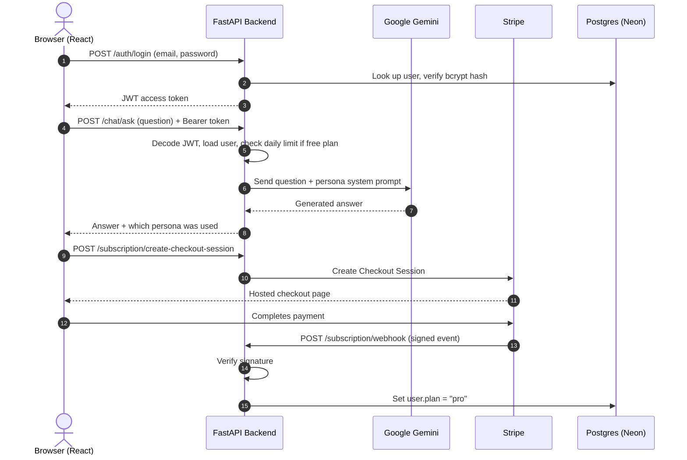
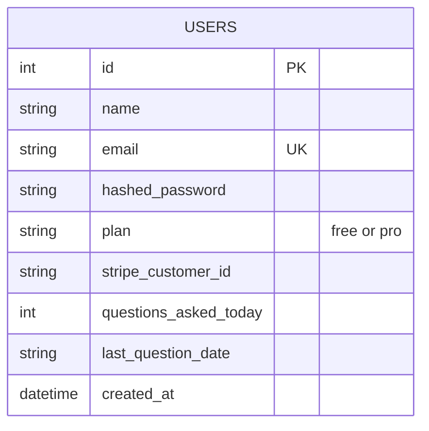

# 📖 Study Assistant Pro

An AI-powered study companion for computer science students. It's a full-stack app — a React frontend and an async FastAPI backend — that lets a signed-in user ask questions and get answers from Google's Gemini model, with a free/pro tier gated by daily usage limits and a real Stripe subscription flow.

[](https://github.com/kireetikotturu/study-assistant-pro)
[](https://study-assistant-8ex344zpq-kireetikotturus-projects.vercel.app)
[](https://study-assistant-backend-vsop.onrender.com)
[](https://study-assistant-backend-vsop.onrender.com/docs)

---

## Table of Contents
1. [What This Project Is](#what-this-project-is)
2. [Why I Built It](#why-i-built-it)
3. [Tech Stack](#tech-stack)
4. [How It's Structured](#how-its-structured)
5. [How the Pieces Talk to Each Other](#how-the-pieces-talk-to-each-other)
6. [Database Schema](#database-schema)
7. [Authentication](#authentication)
8. [The AI Chat Flow](#the-ai-chat-flow)
9. [Free vs. Pro Plans](#free-vs-pro-plans)
10. [Stripe Subscriptions](#stripe-subscriptions)
11. [API Reference](#api-reference)
12. [Running It Locally](#running-it-locally)
13. [Deployment](#deployment)
14. [Problems I Ran Into](#problems-i-ran-into)
15. [What I'd Add Next](#what-id-add-next)
16. [License](#license)

---

## What This Project Is

Study Assistant Pro is a small SaaS-style app: users sign up, log in, and chat with an AI tutor that's prompted to act like a study assistant rather than a generic chatbot. Free users get 5 questions a day with a friendly, simple-explanation persona. Paying users get an unlimited, more rigorous "academic" persona, unlocked through a real Stripe Checkout subscription.

It's built as a monorepo with two independently deployable halves — a Vite/React frontend and a FastAPI backend — talking to each other over a JSON REST API.

## Why I Built It

I wanted a project that wasn't just a CRUD app, but touched the things that actually come up in production: token-based auth, an async database layer, calling a real LLM API with a system prompt, and wiring up billing with signed webhooks instead of trusting the client. It's also just useful — I use it myself to get quick, guided explanations instead of copy-pasteable answers.

## Tech Stack

**Frontend**
- React 19 + Vite for the UI and dev server
- React Router for client-side routing and route protection
- Axios for HTTP requests

**Backend**
- FastAPI (async, built on Starlette + Pydantic)
- SQLAlchemy 2.0 async ORM with `asyncpg`
- Pydantic v2 for request/response validation

**Data & Auth**
- PostgreSQL (hosted on Neon, serverless)
- `passlib` + `bcrypt` for password hashing
- `python-jose` for signing/verifying JWTs

**Third-party services**
- Google Gemini (`gemini-2.5-flash`) for the actual AI responses
- Stripe for subscription checkout and billing webhooks
- Render (backend) and Vercel (frontend) for hosting

## How It's Structured

```
study-assistant-pro/
├── frontend/                      # React + Vite app
│   ├── src/
│   │   ├── main.jsx                # React entry point
│   │   ├── App.jsx                 # Routes: /login, /signup, /chat, upgrade pages
│   │   ├── api.js                  # Central fetch/axios wrapper, attaches JWT
│   │   ├── AuthContext.jsx         # Global auth state (token, user)
│   │   ├── ProtectedRoute.jsx      # Redirects to /login if not authenticated
│   │   └── pages/
│   │       ├── Login.jsx
│   │       ├── Signup.jsx
│   │       ├── Chat.jsx            # Main chat interface
│   │       ├── UpgradeSuccess.jsx  # Stripe checkout success redirect
│   │       └── UpgradeCancelled.jsx
│   └── vite.config.js
│
└── backend/                        # FastAPI app
    ├── requirements.txt
    └── app/
        ├── main.py                 # App factory, CORS, router mounting
        ├── config.py               # Settings loaded from .env via pydantic-settings
        ├── database.py             # Async engine, session factory, User table
        ├── models.py                # Pydantic request/response schemas
        ├── auth.py                  # Password hashing, JWT creation/validation
        └── routes/
            ├── auth_routes.py       # /auth/signup, /auth/login
            ├── chat_routes.py       # /chat/ask
            └── subscription_routes.py  # Stripe checkout + webhook + /subscription/me
```

## How the Pieces Talk to Each Other



## Database Schema

The app currently uses a single `users` table — there's no separate conversation/message history table; each chat request is stateless and only the daily question count is persisted.



- `plan` starts as `"free"` and flips to `"pro"` when Stripe confirms payment (and back to `"free"` if the subscription is cancelled).
- `questions_asked_today` / `last_question_date` implement the free-tier daily limit without needing a cron job — the count just resets the first time a new day's request comes in.

## Authentication

Auth is stateless JWTs, `HS256`-signed:

1. **Signup** (`POST /auth/signup`) — validates the payload with Pydantic (`EmailStr`, password ≥ 6 chars), hashes the password with `bcrypt` via `passlib`, creates the user row, and returns a token immediately (no separate login step needed after signup).
2. **Login** (`POST /auth/login`) — looks up the user by email, verifies the password against the stored hash, and returns a token.
3. **Protected routes** — the frontend sends `Authorization: Bearer <token>` on every request after login. On the backend, FastAPI's `Depends(get_current_user)` decodes the token, pulls the `sub` (email) claim, and loads the matching user row; invalid or expired tokens get a 401.

On the frontend, `AuthContext` holds the token in memory/state and `ProtectedRoute` redirects to `/login` if there isn't one.

## The AI Chat Flow

`POST /chat/ask` is the one endpoint that does the real work:

1. Authenticate the user via the JWT dependency.
2. If they're on the free plan, check `questions_asked_today` against a daily cap (5/day) and reject with a `429` once they hit it — the counter resets automatically on a new calendar day.
3. Pick a system prompt based on plan:
   - **Free** → a "friendly" persona: short, simple, analogy-driven answers (3–5 sentences), ending in a follow-up question.
   - **Pro** → an "academic" persona: precise, rigorous explanations that also respect explicit formatting requests (e.g. "answer in one sentence") instead of always writing an essay.
4. Send the question and system prompt to Gemini (`gemini-2.5-flash`) via the `google-genai` SDK.
5. Return the generated answer, along with which persona produced it and the user's current plan.

## Free vs. Pro Plans

| | Free | Pro |
|---|---|---|
| Daily questions | 5 | Unlimited |
| Persona | Friendly / simple | Academic / rigorous |
| Formatting control | Basic | Follows explicit length/format instructions |
| Price | $0 | Stripe subscription |

## Stripe Subscriptions

- `POST /subscription/create-checkout-session` creates (or reuses) a Stripe Customer for the logged-in user and starts a subscription-mode Checkout Session, redirecting to Stripe's hosted payment page. Success and cancel URLs point back at `/upgrade-success` and `/upgrade-cancelled` on the frontend.
- `POST /subscription/webhook` is the endpoint Stripe calls directly (not the browser). It verifies the request signature against `STRIPE_WEBHOOK_SECRET` before trusting anything in it, then:
  - on `checkout.session.completed` → sets `plan = "pro"` for the user tied to that session's metadata.
  - on `customer.subscription.deleted` → sets `plan = "free"` again.
- `GET /subscription/me` returns the current user's plan and today's question count, which the frontend uses to show usage/upgrade prompts.

Locally, this is tested with the Stripe CLI:
```bash
stripe listen --forward-to localhost:8000/subscription/webhook
```

## API Reference

| Method | Endpoint | Auth | Body | Returns |
|---|---|---|---|---|
| POST | `/auth/signup` | No | `{name, email, password}` | `{access_token, token_type}` |
| POST | `/auth/login` | No | `{email, password}` | `{access_token, token_type}` |
| POST | `/chat/ask` | Bearer JWT | `{question}` | `{answer, persona_used, plan}` |
| POST | `/subscription/create-checkout-session` | Bearer JWT | — | `{checkout_url}` |
| POST | `/subscription/webhook` | Stripe signature | raw Stripe event | `{status}` |
| GET | `/subscription/me` | Bearer JWT | — | `{name, email, plan, questions_asked_today}` |

Full interactive docs are auto-generated by FastAPI at `/docs`.

## Running It Locally

### Backend

```bash
git clone https://github.com/kireetikotturu/study-assistant-pro.git
cd study-assistant-pro/backend

python -m venv venv
source venv/bin/activate      # Windows: .\venv\Scripts\activate

pip install -r requirements.txt
```

Create `backend/.env`:

```env
DATABASE_URL=postgresql+asyncpg://<user>:<password>@<host>/neondb
JWT_SECRET_KEY=change-this-to-a-random-secret
JWT_ALGORITHM=HS256
JWT_EXPIRE_MINUTES=1440

STRIPE_SECRET_KEY=sk_test_...
STRIPE_WEBHOOK_SECRET=whsec_...
STRIPE_PRICE_ID=price_...

GEMINI_API_KEY=your_gemini_api_key
FRONTEND_URL=http://localhost:5173
```

Run it:

```bash
uvicorn app.main:app --host 127.0.0.1 --port 8000 --reload
```

### Frontend

```bash
cd ../frontend
npm install
```

Create `frontend/.env`:

```env
VITE_API_URL=http://localhost:8000
```

Run it:

```bash
npm run dev
```

The app will be at `http://localhost:5173`, talking to the API at `http://localhost:8000`.

## Deployment

**Backend — Render**
- Root directory: `backend`
- Build command: `pip install -r requirements.txt`
- Start command: `uvicorn app.main:app --host 0.0.0.0 --port $PORT`
- All the `.env` variables above go into Render's environment settings, with `FRONTEND_URL` pointed at the live Vercel URL.

**Frontend — Vercel**
- Root directory: `frontend`
- Framework preset: Vite
- Build command: `npm run build` (output: `dist`)
- Environment variable: `VITE_API_URL` set to the live Render backend URL.

## Problems I Ran Into

**`ModuleNotFoundError: No module named 'email_validator'` on deploy.**
Pydantic's `EmailStr` needs `email-validator` installed, but it wasn't in `requirements.txt` — it worked locally because I had it installed globally at some point. Added it explicitly and the deploy went through.

**CORS errors between Vercel and Render.**
The backend was rejecting requests from the deployed frontend because only `localhost` was in the allowed origins list. Fixed by explicitly adding the production Vercel domain to `CORSMiddleware`'s `origins`.

**Stripe webhook signature failures.**
Early on I was reading the request body after FastAPI had already parsed it as JSON, which changed the raw bytes and broke signature verification. Switched to reading `request.body()` directly, untouched, before doing anything else with it.

## What I'd Add Next

- Persist conversation history (a `conversations`/`messages` table) instead of treating every question as a one-off.
- Move chat responses to streaming (SSE or WebSockets) instead of waiting for the full Gemini response.
- Add a `/subscription/me`-driven usage bar in the UI so users can see their remaining free questions before they hit the limit.
- Rate limiting at the infrastructure level, not just the per-user daily counter.

## License

MIT — built by Chandra Kireeti Kotturu.
